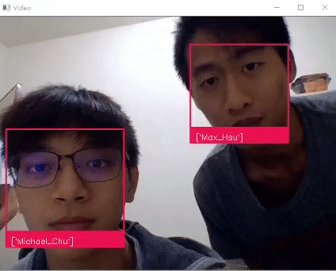

# Real-Time-Face-Recognition-System

This project aims to build a real time system in not noly detecting human faces but also recognizing the identity of each face.
Currently, this system is built on [self-collected datasets](my_own_dataset), in which are there 6 distinct figures, including myself, my partner, my lecturer and also 3 public figures.

Demo video can be found [here](https://www.youtube.com/watch?v=KVXVxqocGCM&t=250s).

## Project Intro

The whole pipelines are broken down into 4 stages:
  * Face Detection over the image
  * Feature Extraction for each faces (embeddings)
  * Train the classifier (use embeddings from previous stage as input)
  * Deploy on WebCam (OpenCV)
  
### Transform faces to embeddings :

  `The best trick of this project could be nothing but this step, since we only need a much more smaller dataset thanks
  to this trick.`
  
  **How does it work?**
  
  We use a pretrained network (ex: OpenFace Network), pretrained on several standard face datasets containing huge amount of datas, as the target network. Then, we input our cropped faces into the network and get the result output from the very last layers as the embeddings. The embedding thus can represent the feature of one's face with a lower dimensional vector and this compression surely extract the information of one's face.
  
  **Why does it work?**
  
  CNN architecture implies that the front layers often extract some small features like boundaries or corners, while the last layers often get a big picture like profile. Therefore, we can say that using a pretrained network to process the face image is a decent way to get a big picture out of it. So, a simple embedding can be a representaion of one's face.
  

For more details, please check the [project report](https://github.com/MaxHsu88/Real-Time-Face-Recognition-System/blob/master/project%20report.pdf)

## Environment and Package required

Python version : `3.7.0`

* OpenCV
* Keras
* dlib
* scikit-learn

## Future Works

Makes it practical in real life, such as letting users to build their own dataset and safety system, scanning face to unlock certain devices like PC, mobile phone or a gate.

## Acknowledgement

* [Modern Face Recognition with Deep Learning (Medium)](https://medium.com/@ageitgey/machine-learning-is-fun-part-4-modern-face-recognition-with-deep-learning-c3cffc121d78) - This article will give you some intuition about face recognition.

* [人臉辨識解析實作](https://medium.com/life-is-fantistic/%E4%BA%BA%E8%87%89%E8%BE%A8%E8%AD%98-face-recognition-cffcec53a544) - This article introduce `triplet loss`, a more robust way to train the networks, also a great method to do `One Shot Learning`, are not used in this project. But worth it a try!

* [Tutorial: Webcam Paint Application Using OpenCV](https://towardsdatascience.com/tutorial-webcam-paint-opencv-dbe356ab5d6c) - It will teach comprehensively about using OpenCV to activate webcam and get the image to process later on.

* [Keras OpenFace Model](https://cmusatyalab.github.io/openface/models-and-accuracies/#pre-trained-models) - You can get pretrained models from here.

## Reference

* [scikit-learn](https://scikit-learn.org/stable/modules/classes.html)
